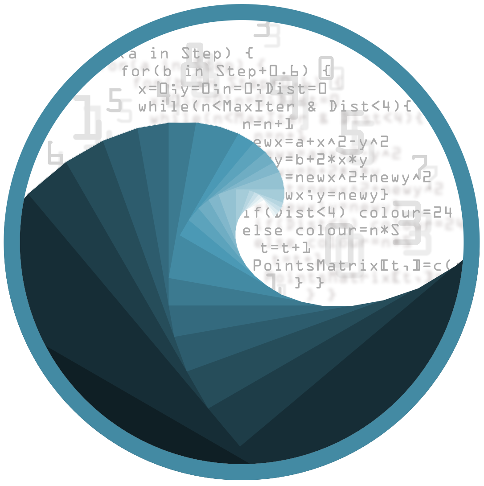
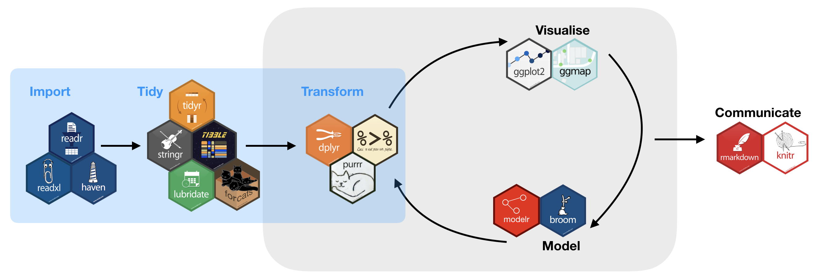

```{r setup, include=FALSE}
knitr::opts_chunk$set(echo = TRUE)
```

<!-- <a href="https://marinedatascience.de" style="height:100px; width:auto; top: 0; left:0;"> -->
<!--    -->
<!-- </a> -->
  

## Kurs-Übersicht

**Willkommen beim 3-tätigen Einstiegskurs zur Datenanalyse mit R!**

In den nächsten 3 Tagen werden wir uns mit folgenden Themen beschäftigen:

- Einstieg in R, Überblick über die Funktionen (Basis und Zusatzpakete) und die Benutzeroberfläche
- Datenstrukturen und Datentypen
- Datenimport und -export
- Datenmanagement und Bereinigen von Daten
- Grafische Auswertungen mit R
- Grundlegende statistische Analysen (Signifikanztest, Regressionsanalysen)
- Darüber hinaus werden wir die Interpolation von Messdaten und Erstellung von Karten anreißen

<br>


<br>
<br>

Dieser Kurs basiert stark auf dem sog. **tidyverse framework** und stellt verschiedene R Pakete vor, die einem R Syntax Dialekt folgen welche den Datenimport, die Datenverarbeitung und die Datenvisualiserung vereinfacht.

<br>
<br>


## Lektionen

Es gibt insgesamt 12 Lektionen die die Themenkomplexe **Programmierung in R**, **Datenexploration & Visualisierung** and **Statistische Modellierung** umfassen. Jede der Lektione enthält interaktive Quizze und Aufgaben (die nur im Webbrowser funktionieren, nicht in den PDF Dateien).

Folgende keyboard shortcuts können genutzt werden während der einzelnen Lektionspräsentationen:


<kbd>o</kbd> führt in den Übersichtsmodus overview mode

<kbd>w</kbd> führt in den widescreen Modus

<kbd>f</kbd> führt in ddie Vollansicht

<kbd>h</kbd> ermöglicht den code highlight Modus

<kbd>control</kbd> (Windows) or <kbd>command</kbd> (Mac) AND <kbd>+</kbd> / <kbd>-</kbd> um rein oder raus zu zoomen<br>

<kbd>p</kbd> öffnet ein Dialogfenster für weitere Informationen (funktioniert nicht in Safari).

Mit <kbd>esc</kbd> wird der aktuelle Modus beendet.

<br>
<br>


## Zeitplan:

Tag | Zeit        | Thema
----|-------------|-----------
Mo  | 9:00-9:30   | Kursablauf, Vorstellungsrunde vorstellung
Mo  | 9:30-10:30  | Lektion 1 - Einführung in R, R Studio und R Skripte
Mo  | 10:30-10:45 | Pause
Mo  | 10:45-12:30 | Lektion 2 - Datenstrukturen
Mo  | 12:30-13:30 | Mittagspause
Mo  | 13:30-15:00 | Lektion 3 - Arbeitsbereich und Operatoren
Mo  | 15:00-15:15 | Pause
Mo  | 15:15-17:00 | Lektion 4 - Data wrangling - 1.Import
Di  | 9:00-10:30  | Lektion 5 - Data wrangling - 2.Tidy Daten
Di  | 10:30-10:45 | Pause
Di  | 10:45-12:30 | Lektion 6 - Data wrangling - 3.Transformation
Di  | 12:30-13:30 | Mittagspause
Di  | 13:30-15:00 | Lektion 7 - Visualisierung in R
Di  | 15:00-15:15 | Pause
Di  | 15:15-17:00 | Fortsetzung Lektion 7 
Di  | 16:00-17:00 | Lektion 8 - Einfache Tests in R
Mi  | 9:00-10:30  | Lektion 9 - Statistische Modellierung 1
Mi  | 10:30-10:45 | Pause
Mi  | 10:45-12:00 | Lektion 10 - Statistische Modellierung 2
Mi  | 12:30-13:30 | Mittagspause
Mi  | 13:30-15:00 | Lektion 11 - Interpolation und Karten
Mi  | 15:00-15:15 | Pause
Mi  | 15:15-16:00 | Lektion 12 - Rmarkdown zur Kommunikation 
Mi  | 16:00-17:00 | Kursabschluss
