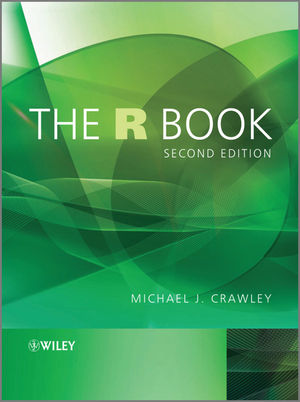

```{r, include=FALSE}
knitr::opts_chunk$set(tidy=FALSE, warning=FALSE, message=FALSE, cache=FALSE, dev.args=list(bg="transparent"), fig.retina = 2)
```

<br>

## Nützliche Websites

#### Allgemein

- [RStudio Cheatsheets](https://www.rstudio.com/resources/cheatsheets/) → gut gemachte Übersichten der Funktionen in den tidyverse Paketen auf 1-2 Seiten
- [R-bloggers](https://www.r-bloggers.com/) → ein Blog mit Neuigkeiten zu den aktuellsten R Entwicklungen und Paketen sowie versch. online tutorials. 
- [DataCamp](https://www.datacamp.com/) → diese Website bietet mittlerweile eine große Bandbreite an R Kursen an, teilweise umsonst sind.
- Um mehr zu R Operatoren zu lesen ist folgendes online tutorial pauf der tutorialcart website empfehlenswert:[ https://www.tutorialkart.com/r-tutorial/r-operators/](https://www.tutorialkart.com/r-tutorial/r-operators/).


#### Visualisierung (v.a. zu ggplot2)

- ggplot2 Dokumentation
    - http://ggplot2.org 
    - http://ggplot2.tidyverse.org
- Hilfe erhält man unter: [ggplot2 mailing list](https://groups.google.com/forum/?fromgroups#!forum/ggplot2)
- Ein Überblick aller geom_functions: http://ggplot2.tidyverse.org/reference/
- Für einen Überblick an den ggplot theme Komponenten empfiehlt sich [Winston Chang's wiki](https://github.com/wch/ggplot2/wiki/New-theme-system) auf github
- Überblick zu ggplot2 Erweiterungen: http://www.ggplot2-exts.org
- Farbschemen zu ColorBrewer insbesondere für Karten: http://colorbrewer2.org
- Das Stowers Institut hat im [ColorChart pdf](http://research.stowers.org/mcm/efg/R/Color/Chart/ColorChart.pdf) eine Liste aller möglichen Farben zusammengestellt, welche sehr hilfreich ist.


#### R Markdown

- Für einen Einstige siehe auch: [R Markdown Webside](https://rmarkdown.rstudio.com) von R Studio.
- R Studio [reference guide](https://www.rstudio.com/wp-content/uploads/2015/03/rmarkdown-reference.pdf).
- Gutes online tutorials: [R for fledglings](https://www.uvm.edu/rsenr/vtcfwru/R/fledglings/08_Markdown.html)


#### R Kurs auf Deutsch

Im Rahmen des [Lehrlabors](https://www.universitaetskolleg.uni-hamburg.de/universitaetskolleg-2-0/lehrlabor.html) der Universität Hamburg gibt es das Projekt [R-lab 2.0](https://rlab.blogs.uni-hamburg.de) welches Online Tutorials zu R in den Umweltwissenschaften mittels *swirl* anbietet. Auch das Institut für Marine Ökosystem und Fischereiwissenschaft ist an dem Projekt beteiligt und ein ähnlicher Datenanalyse R Kurs wie dieser wurde auch als *swirl* Kurs von mir umgesetzt (dieser allerdings auf Englisch).

<br>
<br>

## Nützliche Bücher

#### Allgemein


- Hadley Wickham & Garret Grolemund (2017): **R for Data Science**, O'Reilly Media Inc., CA, U.S.A, 494p. Online accessible at [http://r4ds.had.co.nz/](http://r4ds.had.co.nz/)<br>
→ <small>Dieses Buch deckt so ziemlich diesen Kurs ab und stellt DAS tidyverse Nachschlagewerk dar. Man kann es als Druck kaufen oder online (dann umsonst) lesen.</small>

<br><br><br><br>

#### Visualisierung (ggplots) 


-  Hadley Wickham (2016): **ggplot2 - Elegant Graphics for Data Analysis**, 2nd edition, Springer International Publishing, Switzerland, 260p. Der Code and Text zu dem Buch kann auch von github runtergeladen werden: [https://github.com/hadley/ggplot2-book](https://github.com/hadley/ggplot2-book)

<br><br><br><br><br><br>


- Alboukadel Kassambara (2013): [Guide to Create Beautiful Graphics in R](http://www.sthda.com/english/download/3-ebooks/5-guide-to-create-beautiful-graphics-in-r-book/), 2nd edition, STHDA, 237p.

<br><br><br><br><br>

#### Statistische Modellierung



- Michael J. Crawley (2013): **The R Book**, 2nd edition, Wiley & Sons, Ltd., West Sussex, UK, 975p. An online pdf version is freely available [here](https://www.cs.upc.edu/~robert/teaching/estadistica/TheRBook.pdf).<br>
→ <small>This book is very comprehensive (almost 1000p.!) and covers basic statistics as well as many different statistical modelling approaches (which were beyond the scope of this course). However, it does not built on the tidyverse framework so all the graphics are created with the basis packages.</small>

<br><br><br><br>


- Alain F. Zuur, Elena N. Ieno, Neil J. Walker, Anatoly A. Saveliev, Graham M. Smith (2009): **Mixed Effects Models and Extensions in Ecology with R**, Springer Science+Business Media, LLC, NewYork, U.S.A., 574p. Für mehr Information and die Datendateien siehe auch: [http://highstat.com](http://highstat.com/index.php/mixed-effects-models-and-extensions-in-ecology-with-r)<br>
→ <small>Dieses Buch bespricht kurz die einfache linear Regressionen und ihre Limitierung und stellt dann alternative Ansätze in R vor wie GLMs und GAMs (Appendix A ist ein guter Start in die lineare Regression mit R).</small>

<br><br><br><br>

#### Programmierung in R


- Hadley Wickham (2014): **Advanced R**, Chapman & Hall/CRC The R Series, UK, 456p. Online verfügbar auf: [http://adv-r.had.co.nz](http://adv-r.had.co.nz).<br>
→ <small>Falls Du noch nicht genug bekommen hast von R und richtig in die Programmierwelt eintauchen wills, dann lohnt sich dieses Buch!</small>

<br><br><br><br><br>
